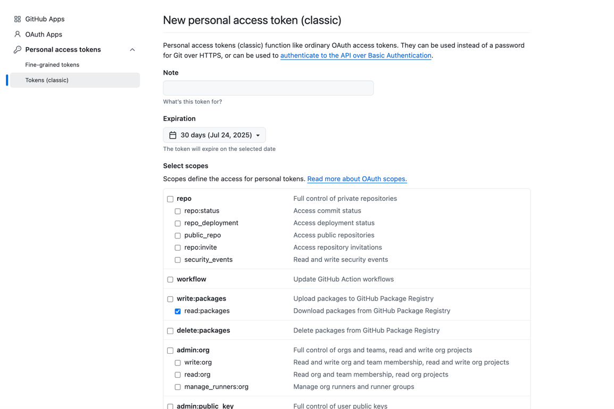

<p align="center">
  
</p>

# TRUSTATTIC Demo

## Prerequisites

**Docker must be installed** on your system before proceeding. 

You must have access to the TRUSTATTIC repositories.

## Access to Registry

### Create a Token
1. Create a Personal Access Token (PAT) to authenticate with the GitHub repository
2. Go to https://github.com/settings/tokens and select **New personal access token (classic)**
3. In the scopes section, select only **read:packages**



### Login to Registry
Execute the following command in your terminal:
```bash
$ echo 'YOUR_PAT_TOKEN' | docker login ghcr.io -u YOUR_GITHUB_USERNAME --password-stdin
```
Replace `YOUR_PAT_TOKEN` with the token you created and `YOUR_GITHUB_USERNAME` with your GitHub username.

### References
For more information, see the [GitHub Container Registry documentation](https://docs.github.com/en/packages/working-with-a-github-packages-registry/working-with-the-container-registry#authenticating-to-the-container-registry)

## Run Demo
Navigate to the directory containing this README and run:
```bash
$ docker compose up
```

### Install CoreAPI
Open http://localhost:8081/install in your browser and store the token.

## Documentation
Check the http://localhost:8081/docs in your browser to see documentation.
